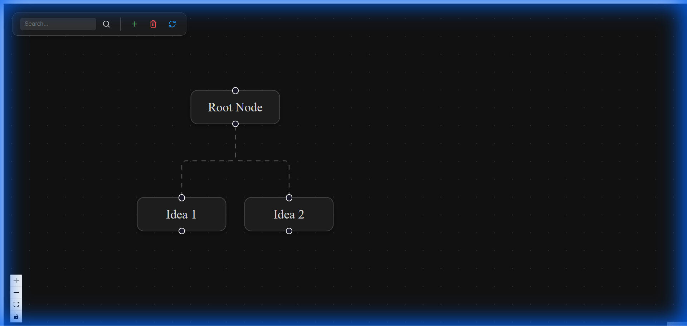

# Tree Visualizer

A powerful, interactive tree visualization tool built with React Flow, designed to help users organize and visualize hierarchical data with ease. This project features a custom layout engine, integrated note-taking, and a smooth user experience.




## Features

- **Interactive Visualization**: Built on React Flow for seamless panning, zooming, and interaction.
- **Smart Layout Engine**: Custom algorithm that automatically centers parents over children and handles variable node widths.
- **Expandable/Collapsible Nodes**: clear clutter by collapsing branches you aren't focusing on.
- **Integrated Note Editor**: Attach rich Markdown notes to any node. Notes are saved and easily accessible.
- **Search & Highlight**: Instantly find nodes by text. The view automatically centers on the result and highlights the path.
- **Modern UI**: Dark mode-ready interface with smooth animations and glassmorphism effects.

## Tech Stack

- **Framework**: React (Vite)
- **Library**: React Flow
- **Styling**: CSS (Custom properties & animations)

## Getting Started

1. **Install Dependencies**
   ```bash
   npm install
   ```

2. **Start the Development Server**
   ```bash
   npm start
   ```
   The application will be available at `http://localhost:5173` (or similar).

## Usage Guide

- **Navigation**: Drag to pan, scroll to zoom.
- **Node Interaction**: 
  - Click a node to select it and open the Note Editor.
  - Click the small handle at the bottom of a node to toggle its children (Expand/Collapse).
- **Toolbar**: Use the floating toolbar to Reset View, Zoom In/Out, or Search for nodes.

---
*Built with precision and care.*